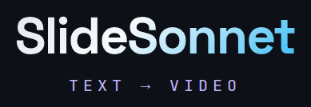

<p align="center">
  
</p>

Write, preview, and render narration for a finished slide **PDF** — keeping the
spoken words in a plain-text **sidecar** file next to the deck.

slideSonnet inverts the usual flow. Your PDF is the frozen artifact; the
narration lives in a human-readable, git-diffable file keyed to slides by stable
ids. Edit a line, hit re-render, and only that line is re-synthesized — no
recompiling slides, no re-recording a microphone. A local GUI gives you
subtitle-style editing synced to each slide; an LLM can write the first draft;
the CLI scripts the whole pipeline.

> **v1 is a rewrite.** Earlier 0.x releases compiled MARP/Beamer *source* into
> video with narration embedded inline (`<!-- say: -->`, `\say{}`). v1 works
> from a **PDF + narration sidecar** instead. See `CHANGELOG.md`.

## How it works

```
deck.pdf  ──(invisible \ssid markers)──┐
                                        ├──►  slidesonnet  ──►  deck.mp4 + deck.srt
deck.narration  ──(@slide-id blocks)────┘                       (preview in the GUI)
```

1. **Mark** every slide in your Beamer source with a stable id (`\ssid{...}`),
   compile to PDF.
2. **Scaffold** a sidecar from the PDF's ids (`slidesonnet init`).
3. **Write** narration — by hand, by an LLM, or in the GUI (`slidesonnet edit`).
4. **Render** a narrated (or silent) MP4 with subtitles (`slidesonnet export`).

## Installation

### External dependencies

| Tool | Required? | What it does | Install |
|---|---|---|---|
| **ffmpeg / ffprobe** | Yes | Audio + video composition | `sudo apt install ffmpeg` |
| **pdftoppm** | Yes | Rasterize PDF pages to images | `sudo apt install poppler-utils` |
| **latexmk + pdflatex** | To compile your deck | Build the Beamer PDF (your job, not the tool's) | `sudo apt install latexmk texlive-latex-base` |

PyMuPDF (PDF id extraction) and the editor's web server (FastAPI + Uvicorn)
install as Python dependencies; the editor's browser interface comes built. After installing, run `slidesonnet doctor`.

slideSonnet runs on Linux with Python 3.13+ (macOS is untested). Native Windows is not
supported; on Windows, use it inside [WSL](https://learn.microsoft.com/windows/wsl/)
(the editor can still open in your Windows browser — see the WSL note below).

### Install for use

Install slideSonnet as an isolated, global CLI — its own virtualenv, separate
from your system Python and any source checkout:

```bash
uv tool install --prerelease=allow "slidesonnet[kokoro]"
# or: pipx install --pip-args=--pre "slidesonnet[kokoro]"
```

v1 is still a pre-release (1.0.0a…), so the pre-release flag is needed until
1.0 is final: without it, the installer picks the old 0.x tool, which works
differently (it compiled slide *source*, not PDFs). `slidesonnet --version`
should print 1.0.0a-something.

The `[kokoro]` extra adds [Kokoro](https://github.com/hexgrad/kokoro) (82M,
Apache-2.0) for free, natural-sounding local speech (~2x real-time on CPU;
the model downloads on first use). Then run `slidesonnet doctor` to confirm the
external tools above are visible.

Upgrade with `uv tool upgrade --prerelease=allow slidesonnet`; remove with `uv tool uninstall
slidesonnet`. To hack on slideSonnet itself instead, see
[Development](#development) for the editable install.

## Quick start

```bash
# 1. Drop the LaTeX macro next to your Beamer source and \usepackage it
slidesonnet sty                      # writes slidesonnet.sty

# 2. In your .tex: \usepackage{slidesonnet} and \ssid{...} on every frame,
#    then compile. An ordinary compile is a *plain* build: page numbers and
#    progress bars stay hidden while you iterate.
latexmk -pdf deck.tex

# 3. Scaffold the narration sidecar from the PDF's slide-ids
slidesonnet init deck.pdf            # writes deck.narration

# 4. Write narration (edit deck.narration, or open the editor), then check it
slidesonnet edit deck.pdf
slidesonnet check deck.pdf

# 5. Render a draft from the plain build: narrated MP4 + subtitles
slidesonnet export deck.pdf -o deck.mp4 --draft      # writes deck.draft.mp4

# 6. For the final video, compile a final build (page numbers shown), then
#    export without --draft
latexmk -pdf -usepretex='\def\ssfinal{}' deck.tex
slidesonnet export deck.pdf -o deck.mp4              # writes deck.mp4
```

A final export refuses a plain build, a deck `check` reports errors for, a deck
with no narration yet, and one with review conversations still open, and says
which. `--draft` exports anyway and names the file `<name>.draft.mp4`, so a
draft never overwrites the real video.

For a quick look while you iterate, add `--fast` (the editor's **Quick export**
box): 720p, plain cuts instead of transitions, and the stills encoded in one
pass instead of frame by frame. The audio and subtitles are the full export's.
It writes `<name>.fast.mp4`, so it never replaces the full-quality video. On the
basel demo (6½ minutes, audio already generated) the full export takes about
two minutes and `--fast` about 15 seconds, then 2 seconds for a repeat after a
slide-only change.

## Marking slides — the `\ssid` macro

`slidesonnet sty` writes `slidesonnet.sty`. In your Beamer preamble add
`\usepackage{slidesonnet}`, then give each emitted page an id:

```latex
\begin{frame}
  \ssid<1>{euler-setup}     % id for overlay step 1
  \ssid<2>{euler-trick}     % id for overlay step 2  (ranges work: \ssid<2-3>{...})
  \only<1->{...}\onslide<2->{...}
\end{frame}

\begin{frame}
  \ssid{intro-title}        % non-overlay frame: one id for its single page
  ...
\end{frame}
```

The id is stamped as **invisible** text (PDF rendering mode 3 — like an OCR
layer): never shown, on any background, but reliably recovered from the text
layer. Any page you forget to name gets a positional `auto-…` default and a
warning, so it gets a real name.

## The narration sidecar

An indented, line-oriented, git-diffable file (`deck.narration`). Each slide is
an `@id` block of one or more `utterance:` blocks and `pause:` lines:

```
# a comment
@intro-title
  utterance:
    text: Welcome to the course on the Basel problem.
  pause: 1.5
  utterance:
    text: Today we'll see how Euler summed the reciprocals of the squares.

@intro-overview
  pause: 3                  # silent slide — held 3s while they read

@euler-trick
  utterance:                # voice and pace are optional
    voice: bernoulli
    pace: slow              # slow | normal | fast
    text: Watch the denominators carefully. This is the trick.
```

- `@<slide-id>` starts a block; each `utterance:` carries the spoken `text:`
  plus optional `voice:` / `pace:` / `direct:` (a director's note Inworld can
  follow). A slide can mix voices — each utterance is its own synthesis call.
- `[Mengoli](/menˈɡoːli/)` in a line fixes how a word is said (IPA or a
  respelling) while the subtitles still read "Mengoli".
- `pause: N` is an explicit silence in seconds: between utterances, as an
  end-of-slide hold, or alone as a silent slide.
- A slide can bracket itself with `transition-in:` / `transition-out:` lines:
  a name and seconds, e.g. `fade 0.5`. Besides `cut` (the default) there are
  fades (`fade`, `fadeblack`, `fadewhite`, `dissolve`, `crossfade`), directional
  `wipe…`/`slide…`/`cover…`/`reveal…` (e.g. `wipeleft`, `slideup`), and
  `circleopen`/`circleclose`.

The full authoring guide — marking overlay steps, the complete sidecar
grammar, and the optional `slidesonnet.toml` config — is in
[`docs/authoring.md`](docs/authoring.md).

## The editor

`slidesonnet edit deck.pdf` opens the editor in your browser (a local server;
with Kokoro nothing leaves your machine, while the paid Inworld engine sends the
narration text to Inworld): page through the deck, edit narration beside each
slide, set voice/pace, generate per-slide TTS, and play it back. Typing is saved
as you go. **Play all** plays slide by slide from where you are, starting at
once (the next slide is prepared while this one plays). **Watch as video**
plays one pre-rendered track with the pauses and transitions baked in, changing
the slide on the audio's own clock, so it matches the exported video exactly.
A diagnostics panel flags duplicate, missing, orphan, or `auto-…` ids.

### Reviewing an agent's changes

When an agent (e.g. Claude Code with the bundled `beamer-writer` skill) revises
a deck, you review its work in the editor's **Review** tab. The first time the
editor opens a deck it records a *base*, and every slide that has changed since
shows its old version beside the new one, with a word-by-word diff of its narration.

Work is organised into **conversations**: each covers one or more slides, or
the whole deck — a new conversation starts about the slide on screen; remove
that slide's tag to make it about the whole deck. Standing instructions
("British spelling everywhere") can live in a whole-deck conversation you leave
open. Choosing a conversation greys out the other slides and shows its messages. From there you reply, ✓ accept, or reopen
it, and ✎ renames it. **Send** wakes an agent waiting for your notes. **Clear
accepted** makes accepted changes the new base. A slide that changes
with no conversation is filed and flagged, so nothing slips through unnoticed.
Conversation history lives in `<deck>.review` beside the deck.

The agent's side is `slidesonnet review …`:

```bash
slidesonnet review wait    --since CURSOR --json       # block until you press Send in any deck here
slidesonnet review wait    deck.pdf --since N --json   # ...or in this one deck
slidesonnet review list    deck.pdf --mine --json      # conversations awaiting the agent
slidesonnet review comment deck.pdf @x @y -m "…" [--title "…"]   # open a conversation
slidesonnet review comment deck.pdf -m "…"                        # … about the whole deck
slidesonnet review reply   deck.pdf c3 -m "…" [--add-slides @z] [--remove-slides @w] [--title "…"]
slidesonnet review title   deck.pdf c3 "Shorter Euler proof"      # rename, no message
slidesonnet review status  deck.pdf                   # changed slides, unfiled changes
```

One `review wait` with no PDF listens to every deck under the current folder (or
`--root DIR`), so an agent working through a course needs a single listener: it
names each deck you pressed Send in and prints a cursor to pass back as `--since`.

A conversation's id (`c3`) never changes. Its title is only a display name,
set by the latest `--title` or `review title` (or ✎ in the editor).

### Many decks in one session

The editor opens on a **library** of the decks it finds, so a course of decks
doesn't mean relaunching per deck:

```bash
slidesonnet edit                      # decks under the current folder
slidesonnet edit ~/courses/aicode     # decks under a course folder
slidesonnet edit deck.pdf             # that deck, plus its neighbours
slidesonnet edit deck.pdf --root ~/courses   # ...while browsing a wider tree
```

A deck is any PDF with a matching `.narration` beside it; subfolders are searched
(`week01/intro/intro.pdf` and friends), and dot-folders, `node_modules`, and deck
caches are skipped. Each deck shows how much of it is narrated; type to filter
(press **/** or **Ctrl+K** to jump to the search box, **Enter** opens the
highlighted deck), and PDFs without a narration file are listed at the bottom
with the command that starts one. Once you're in a deck, **Ctrl+K** opens a type-to-filter deck
switcher and **Alt+←/→** step to the previous/next deck. Switching saves the slide
you were editing first and cancels audio still generating for the deck you're
leaving — clips already finished stay cached, and coming back re-queues the rest.

**WSL note:** to open the editor in your *Windows* browser instead of a Linux
one:
- `slidesonnet edit deck.pdf --app` — a chromeless app window via Edge/Chrome
  (auto-detected on the Windows side; Firefox has no app-window mode).
- install `wslview` (`sudo apt install wslu`) — used automatically — for a normal
  tab in your default browser.
- `--browser CMD` for full control (e.g. `"cmd.exe /c start"`, or a browser path;
  a `{url}` token is substituted). Also settable via `SLIDESONNET_BROWSER`.

## CLI

```
slidesonnet sty    [-o PATH]                       write the LaTeX macro
slidesonnet init   deck.pdf [--merge|--force]      scaffold a blank sidecar
slidesonnet check  deck.pdf                         reconcile ids (exit≠0 on errors)
slidesonnet tts    deck.pdf [--engine ...] [--id ID ...] [--yes]   synthesize into the cache
slidesonnet export deck.pdf [-o OUT.mp4]      # default: deck.mp4 beside the deck
        [--output-dir DIR] [--subtitles-dir DIR]   # or [video] output_dir / subtitles_dir
        [--where]                      # print where the files would go; render nothing
        [--draft]                      # not final yet: writes OUT.draft.mp4
        [--fast]                       # quick look: 720p, cuts; writes OUT.fast.mp4
        [--engine kokoro]              [--silent]
        [--timing tts|estimate|fixed:N] [--wpm N]
        [--subtitles srt|vtt|both|none] [--sub-granularity segment|slide]
        [--keep-scratch]               # keep render intermediates (debugging)
        [--yes]                        # generate paid clips without asking
slidesonnet subs   deck.pdf -o OUT.srt|OUT.vtt [--engine ...] [--format srt|vtt]
        [--timing ...] [--allow-estimates]    # export already writes these
slidesonnet edit   [deck.pdf|FOLDER] [--root DIR]   launch the editor
slidesonnet review comment|reply|title|list|status|wait|...   review conversations
slidesonnet clean  deck.pdf [--keep nothing|api|current|exact] [--dry-run]   # paid clips → trash
slidesonnet pool   status  [deck.pdf]               which clip pool a deck uses, and why
slidesonnet pool   migrate --root DIR [--apply]     move old local caches into the pool
slidesonnet pool   prune   --root DIR [--apply] [--keep current|exact|api] [--empty-trash]
slidesonnet doctor
```

Errors print one line saying what went wrong and how to fix it; add `-v`
(`slidesonnet check … -v`, before or after the command) for the full traceback.

`--audio-dir DIR` before any command (or `SLIDESONNET_AUDIO_DIR`, or
`[cache] audio_dir` in `slidesonnet.toml`) points it at a **shared speech-clip
pool**, so every worktree of a course reuses the same synthesized audio instead
of re-buying it. See the config section of the authoring guide.

Every operation is also a typed Python function in `slidesonnet.api`
(`init_sidecar`, `synthesize_deck`, `export`, `write_subs`, …) so an LLM/CI loop
can drive the pipeline without the GUI.

### Engines and keys

| Engine | Install | Runs | Cost |
|---|---|---|---|
| `kokoro` (default) | `"slidesonnet[kokoro]"` | locally, CPU | free |
| `inworld` | `"slidesonnet[inworld]"` | Inworld's cloud: narration text is sent to Inworld | paid per clip |
| `qwen3` | `"slidesonnet[qwen3]"` | locally, GPU (slow); can clone your voice | free |

Pick one per run with `--engine`, or per deck with `[tts] backend` in
`slidesonnet.toml`. Inworld needs an API key: put `INWORLD_API_KEY=...` in a
`.env` file beside the deck (a parent folder, or the folder you run from, also
works; a shell export wins over `.env`). Keep `.env` out of git. Before
generating paid clips, `tts` and `export` say how many new clips they would
make and ask; `--yes` answers for you, and without a terminal (scripts, CI)
they refuse unless `--yes` is given. Clips already generated are cached and
reused for free.

`slidesonnet.toml` (optional, beside the deck) also sets engine voices and
speeds (`[tts.kokoro]`, `[tts.inworld]`, `[tts.qwen3]`; Inworld also takes
`temperature`, `delivery_mode`, `language`, `text_normalization` and
`send_direction`), named voices
(`[voices.<name>]`), video settings (`[video]`: `resolution`, `fps`, `crf`,
`preset`, `pre_silence`, `tail_seconds`, `keep_scratch`), the run log
(`[logging]`: `file`, `level`, `max_bytes`, `backup_count`), a shared clip pool
(`[cache] audio_dir`), and `pronunciation` files (a top-level key, so it goes
above the first `[table]`). Every key, with its default, is in the
[authoring guide](docs/authoring.md#config-slidesonnettoml-optional).

### Timing & silent renders

`--timing tts` (default) uses real synthesized audio. `--timing estimate`
approximates from word count at `--wpm` for a fast rough cut with no TTS;
`--timing fixed:N` holds every page N seconds. `--silent` renders with no
narration (timing falls back to `estimate`) — pair it with subtitles for a
captioned silent cut.

## Examples

- [`examples/basel-problem/`](examples/basel-problem/) — a 22-page Euler proof
  with overlay steps and a second voice for the Bernoulli quote.
  **[▶ Watch on YouTube](https://youtu.be/pjjHS9vhjpk)** (Inworld narration).
- [`examples/showcase/`](examples/showcase/) — a self-narrated tour that teaches
  the workflow as a two-voice dialog (written in this very format).

Build them from source with `make basel` / `make showcase` (Kokoro). Videos are
hosted as GitHub Release assets, not committed.

## Development

```bash
make install      # editable install with Kokoro + dev tools
make test-unit    # fast unit tests (no external tools)
make test         # full suite (needs ffmpeg, pdftoppm, kokoro)
make lint         # ruff
make typecheck    # mypy --strict
```

All source is fully typed (`mypy --strict`); paid cloud TTS is never exercised
in tests (it costs money) — Kokoro and mocks only.

## License

slideSonnet's own code is **MIT** (see [`LICENSE`](LICENSE)).

It depends on [PyMuPDF](https://pymupdf.readthedocs.io/) (for reading slide-ids),
which is **AGPL-3.0** (or a commercial license from Artifex). AGPL is copyleft:
if you redistribute slideSonnet or run it as a network service, the AGPL terms
apply to the combined work. For local use or a normal open-source install this
is a non-issue — it only matters if you want to build a *closed-source* product
on top of it.
